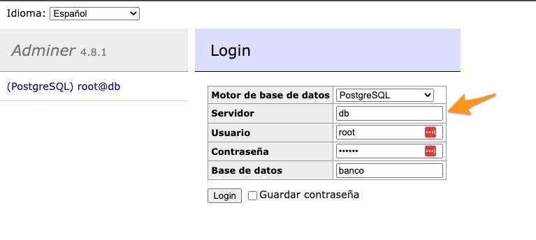

# M7-ABP_1

## Repositorio
https://github.com/molavec/M7-ABPRO_1

### Integrantes
* Miguel
* Nico
* Carlos Gonzalez
* José Abraham

## How to

Se crea una carpeta por cada tarea

### Docker

Puedes cambiar los datos de conexión en el `docker-compose.yml`
```yaml
  db:
    image: postgres
    restart: always
    environment:
      # POSTGRES_USER: postgres
      # POSTGRES_PASSWORD: example
      # POSTGRES_DB: m7-abp_1
      POSTGRES_USER: root
      POSTGRES_PASSWORD: 123456
      POSTGRES_DB: banco
    ports:
      - 5432:5432
```

Para utilizar adminer hay que poner el nombre del servicio en el host. Para el caso anterior los parámetros de conexión son:



Notar que en vez de utilizar `localhost` se utiliza `db`. Esto se debe a que en el contenedor de adminer no hay nada en el `5432`, ya que postgre se ejecuta en un contenedor independiente. En docker para llamar se identifica el `nombre del equipo` mediante el nombre del servicio.

Más info: https://stackoverflow.com/questions/45637206/docker-is-the-server-running-on-host-localhost-1-and-accepting-tcp-ip-con


### m1

Utilizar los siguientes comandos en la carperta `m1` para probar

``` bash
node index.js nuevo 'Bryan May' 12.345.678-9 guitarra 7
```

``` bash
node index.js traer
```

``` bash
node index.js rut 12.345.678-9
```

``` bash
node index.js editar 'Bryan May' 12.345.678-9 guitarra 10
```

```bash
node index.js eliminar 12.345.678-9
```


### m2

Utilizar el siguiente comando en la carperta `m2` para probar

Nota: como somos unos estudiantes adelantados ya en el m1 estabamos utilizando el declare.

``` bash
node index.js nuevos estudiantes.json
```


### m3

Utilizar el siguiente comando en la carperta `m3` para levantar el servidor express

```bash
yarn server
```

### m4

Utilizar los siguientes comandos en la carperta `m4` para probar

```bash
node index.js add 'Depósito enero' '2023/01/01' 10000 1
```

```bash
node index.js get 1
```

```bash
node index.js balance 1
```


### m5

Utilizar los siguientes comandos en la carperta `m5` para probar

```bash
node index.js 
```